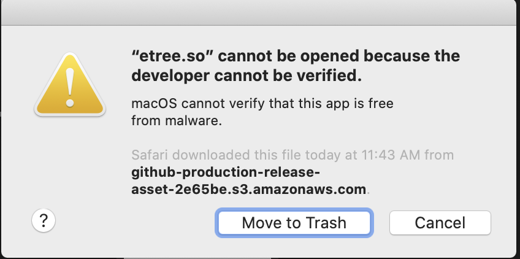
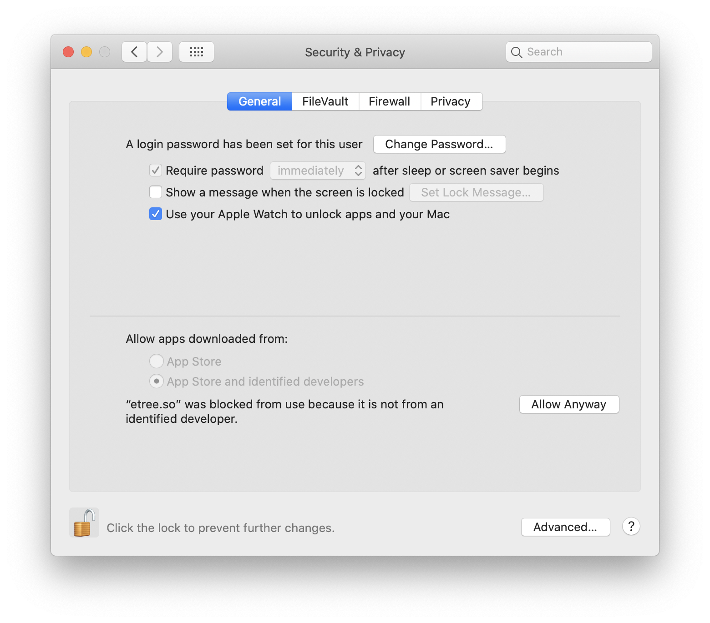

# Emoji Taco 🌮 (for python3 - Version 2.x)

[**Download the latest release**](https://github.com/jeeftor/EmojiTaco/releases)

## Python 3 Notes

* Notifications aren't currently working that I'm aware of - but this doesn't really impact users at all
* Code-base *might* be smaller than Python2 version
* Assumes you have a `python3` executable available

### Unicode website

If you run in to trouble its possible the unicode website is down. You can check [here](https://downfor.io/unicode.org). _This was an issue 9/10 April 2020_

<!--
## Catalina Notes

- _As of latest version this section may not be needed - I no longer use `lxml`_
- If you do get this error I guess follow these directions

NOTE: Security settings

On catalina you may get an error like this:

Open **Security & Privacy** settings and

select the **Always Allow** button
-->
## About
This emoji workflow scrapes Unicode.org to pull down the latest set of EMOJI!!.  On first run you **must** be connected to the Internet so that you can generate the initial Emoji set.  As new emoji are released you should be able to re-generate to keep the plugin up to date.

<!--## Why

This workflow was developed because none of the existing emoji workflows had the support for the taco icon or any of the newer icons such as the multi-racial people

-->

# To initialize the emoji set type

**init emoji** this will go to `unicode.org` and scrape the current emoji list.  It parses the mega chart pulling out all Emoji that exist in the apple ecosystem.

# Emoji Searching

Use the **e** command to search for emoji.

You can use the `-` to exclude items from a search such as:

# Emoji Count
If there are more than 9 matches a dialog showing the emoji count will appear.

### Commands

* alt/option (**⌥**)  -  Show Unicode Values
* cmd (**⌘**) - Show Python String
* ctrl (**⌃**) - Show Python String *decoded*
* shift (**⇧**) - Display the image in QuickLook

# Non Apple-supported Emoji

There are emoji that are not supported on Apple devices and/or not supported on OSX but maybe exist in a beta version of iOS.

For example the Rainbow Flag emoji currently will render a pride flag on iOS but on OSX (at the time of this writing) it will render a while flag followed by a rainbow symbol 🏳️‍🌈️.  You should still be able to use this and other emoji even if they render strangely on the current OS.

# Configuration Options
You can change the keyword in the settings of the workflow

